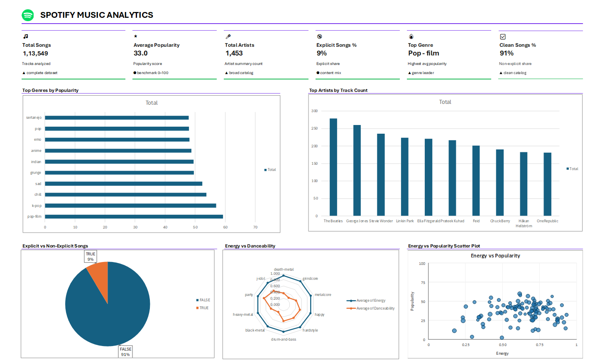

# 🎵 Spotify Music Analytics Dashboard

A professional music analytics dashboard built in **Microsoft Excel** using **Pivot Tables, Charts, KPIs, and Data Cleaning techniques** to analyze Spotify music data and generate meaningful business insights.

---

#  Project Overview

This project focuses on analyzing Spotify music data to discover trends in:

- Music genres
- Artist popularity
- Explicit vs clean songs
- Energy and danceability
- Track popularity patterns

The project is built inside a single Excel workbook containing separate sheets for raw data, cleaned analysis data, pivot tables, and the final interactive dashboard.

---

#  Dashboard Preview



---

#  Features

##  KPI Cards
- Total Songs
- Average Popularity
- Total Artists
- Explicit Songs %
- Clean Songs %
- Top Genre

---

##  Visualizations
- Top Genres by Popularity
- Top Artists by Track Count
- Explicit vs Non-Explicit Songs
- Energy vs Danceability Radar Chart
- Energy vs Popularity Scatter Plot

---

#  Tools & Technologies Used

- Microsoft Excel
- Pivot Tables
- Pivot Charts
- Power Query
- Data Cleaning
- Excel Formulas
- Dashboard Design

---

#  Dataset Source

The dataset used in this project was taken from Kaggle:

 [Spotify Tracks Dataset](https://www.kaggle.com/datasets/maharshipandya/-spotify-tracks-dataset)

---

#  Dataset Details

The dataset contains more than 100,000 Spotify tracks with multiple audio and metadata features used for music analytics and visualization.

### Main Attributes
- Track Name
- Artist
- Album
- Popularity
- Genre
- Danceability
- Energy
- Loudness
- Explicit Content
- Tempo
- Valence
- Acousticness

---

#  Data Cleaning Process

The raw dataset was cleaned using:
- Removing null values
- Formatting inconsistent data
- Splitting artist names
- Handling duplicates
- Converting data types
- Creating analysis-ready tables

---

#  Key Insights

- **Pop-film** is the most popular genre.
- Most songs are **non-explicit (91%)**.
- Higher energy songs tend to have medium popularity.
- A few artists dominate the track count distribution.
- Genres like K-pop and Chill have strong popularity trends.

---

#  Workbook Sheets

| Sheet Name | Description |
|---|---|
| Raw-data | Original dataset imported into Excel |
| Analysis_data | Cleaned and transformed dataset |
| PivotTables | Backend pivot tables used for charts & KPIs |
| Spotify BI Dashboard | Final interactive analytics dashboard |

---

#  Dashboard Components

| Component | Purpose |
|---|---|
| KPI Cards | Quick performance overview |
| Bar Charts | Genre & artist comparison |
| Pie Chart | Explicit content analysis |
| Radar Chart | Audio feature comparison |
| Scatter Plot | Correlation analysis |

---

#  Project Structure

```plaintext
Spotify-Music-Analytics/
│
├── Musicdashboard.xlsx
│   ├── Raw-data
│   ├── Analysis_data
│   ├── PivotTables
│   └── Spotify BI Dashboard
│
├── dashboard-preview.png
└── README.md
```

---

#  Learning Outcomes

Through this project, I learned:
- Advanced Excel dashboard creation
- Data visualization techniques
- Data cleaning using Power Query
- KPI design
- Business intelligence reporting
- Analytical storytelling

---

#  Future Improvements

- Add slicers for interactivity
- Add yearly trend analysis
- Connect live Spotify API data
- Create Power BI version
- Add advanced predictive analytics

---

#  Connect With Me

### LinkedIn
Add your LinkedIn profile link here

### GitHub
Add your GitHub profile link here

---

# ⭐ If You Like This Project

Give this repository a ⭐ on GitHub!
